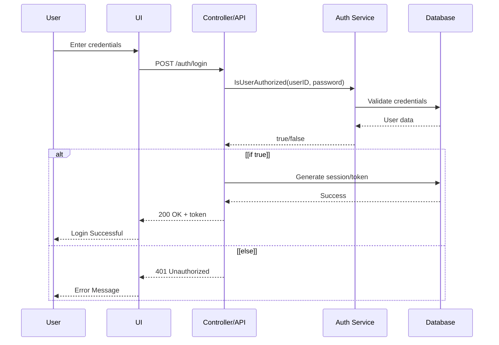
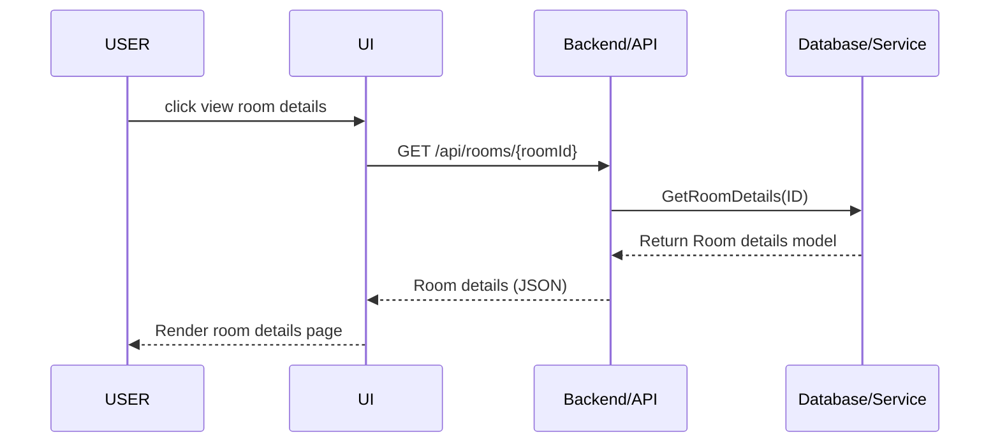
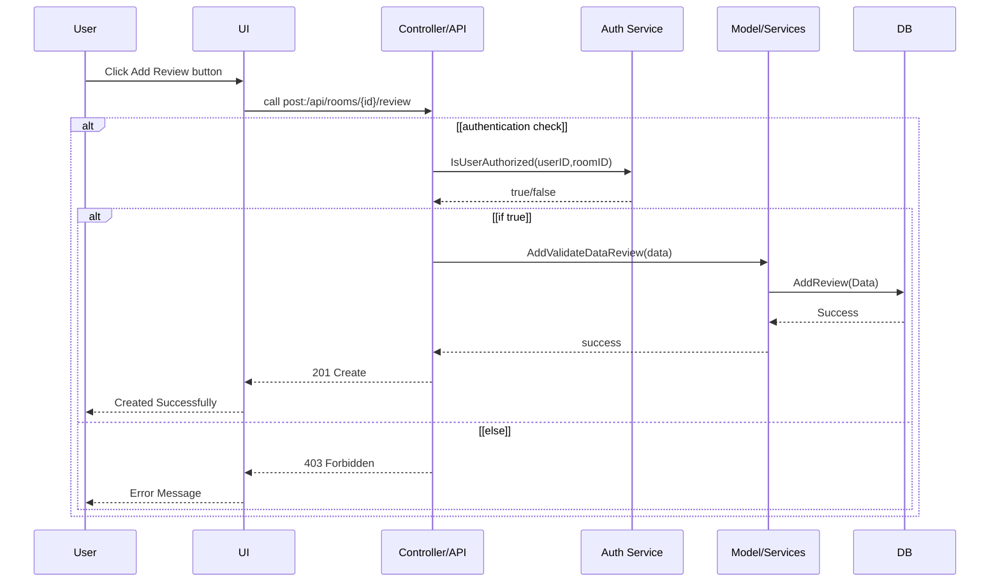
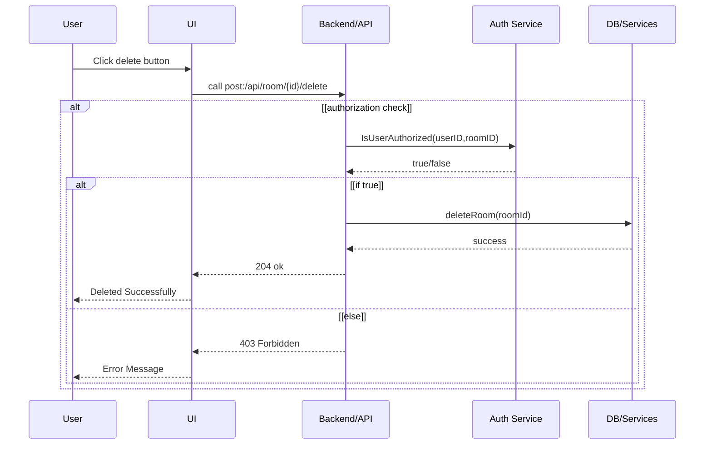

# HBnB Technical Documentation

**Project Team:**
- **Raghad Albeladi** (Task 2: Sequence Diagrams)
- **Najwa Aljunaidel** (Task 1: Class Diagram) 
- **Bushra Alotaibi** (Task 0: Package Diagram)

**Project:** HolbertonSchool HBnB  
**Date:** August 2025  

---

## Table of Contents
1. [Introduction](#introduction)
2. [High-Level Architecture](#high-level-architecture)
3. [Business Logic Layer](#business-logic-layer)
4. [API Interaction Flow](#api-interaction-flow)
5. [Conclusion](#conclusion)

---

## 1. Introduction

### Project Overview
The HBnB (Holberton Airbnb) project is a comprehensive web application that replicates the core functionality of Airbnb. This technical document serves as a detailed blueprint for the HBnB project, providing architectural guidance and design specifications for the implementation phases.

### Document Purpose
This document consolidates all architectural diagrams, design decisions, and system specifications created during the planning phase. It serves as:
- A reference guide for development teams
- A blueprint for system implementation
- Documentation of design decisions and their rationale
- A communication tool for stakeholders

### Document Scope
This documentation covers:
- High-level system architecture using package diagrams
- Detailed business logic layer class relationships
- API interaction flows through sequence diagrams
- Design patterns and architectural decisions

---

## 2. High-Level Architecture

### Package Diagram Overview
*Created by: Bushra Alotaibi*

The HBnB application follows a layered architecture pattern with clear separation of concerns across three main layers:
2.1 🔹 Presentation Layer

Responsibility: Handles user interactions through services and APIs
Components: Web interfaces, mobile apps, RESTful API endpoints
Function: Manages all user-facing interactions and external service communications
Technologies: HTML, CSS, JavaScript, React/Vue.js, API Gateway

2.2 🔹 Business Logic Layer

Responsibility: Contains core application logic and models
Core Models: User, Place, Review, and Amenity
Design Pattern: Accessed through a simplified interface using the Facade pattern
Function: Implements business rules, validation, and core application workflows
Benefits: Simplified interface hides complex subsystem interactions

2.3 🔹 Persistence Layer

Responsibility: Responsible for data access via DAOs and direct interaction with the database
Components: Data Access Objects (DAOs), Database connections, ORM frameworks
Function: Handles all data storage, retrieval, and database operations
Technologies: SQL databases, ORM frameworks, connection pooling

Architecture Benefits

Modularity: Clear separation enables independent development and testing
Scalability: Each layer can be scaled independently based on system demands
Maintainability: Isolated concerns reduce complexity and improve code organization
Testability: Each layer can be tested in isolation with proper mocking
Facade Pattern Implementation: Provides a unified interface to the complex business logic subsystem

## 3. Business Logic Layer

### Class Diagram Structure
*Created by: Najwa Aljunaidel*

Core Entities
🔹 User Entity

Stores user information (name, email, password)
Manages user registration and profile updates
Tracks owned places and written reviews

🔹 Place Entity

Contains property details (title, description, price, location)
Links to the owner (User) who created it
Manages place creation, updates, and deletion

🔹 Review Entity

Stores user feedback for places (rating, comment)
Links to both User (reviewer) and Place (reviewed property)
Handles review creation, updates, and removal

🔹 Amenity Entity

Defines available amenities (WiFi, Pool, etc.)
Can be associated with multiple places
Manages amenity creation and updates

Entity Relationships

User → Place: One user can own multiple places
User → Review: One user can write multiple reviews
Place → Review: One place can have multiple reviews
Place ↔ Amenity: Many-to-many relationship (places can have multiple amenities)

Key Business Rules

All entities use UUID for unique identification
Users must be authenticated to create places/reviews
Only place owners can modify their properties
Users cannot review their own places
All entities track creation and update timestamps

The business logic layer implements the core entities and their relationships within the HBnB system as illustrated in the UML class diagram above.

## 4. API Interaction Flow 

### Sequence Diagrams Overview
*Created by: Raghad Albeladi*

The sequence diagrams illustrate the interaction flow between different components for key API operations. These diagrams show how the Presentation Layer (UI/API), Business Logic Layer (Services), and Persistence Layer (Database) communicate to handle user requests.

## 4.1 **Sign Up / Login
This diagram shows the authentication process when a user attempts to log into the system.

Key Interactions:

User submits credentials through the UI
API validates credentials through Auth Service
Database verification and token generation
Success or error response to user 

## 4.2  **Get Room Details Flow**
This diagram illustrates how the system retrieves and displays detailed information about a specific place/room.

Key Interactions:

User requests to view room details
API fetches room information from database
Structured room data returned as JSON
UI renders the detailed room information

## 4.3 **Add Review Flow**
This diagram shows the process of adding a review for a place, including authentication and authorization checks.

Key Interactions:

User initiates review creation
System verifies user authorization
Review data validation through Service layer
Database persistence with success confirmation

## 4.4 **Delete Place**
This diagram demonstrates the place deletion process with proper authorization checks.

Key Interactions:

User requests place deletion
Authorization verification for ownership
Database deletion operation
Success confirmation or error handling

## 5. Conclusion
This technical documentation provides a comprehensive blueprint for the HBnB project implementation. The layered architecture ensures maintainability and scalability, while the detailed class relationships support robust business logic implementation.
