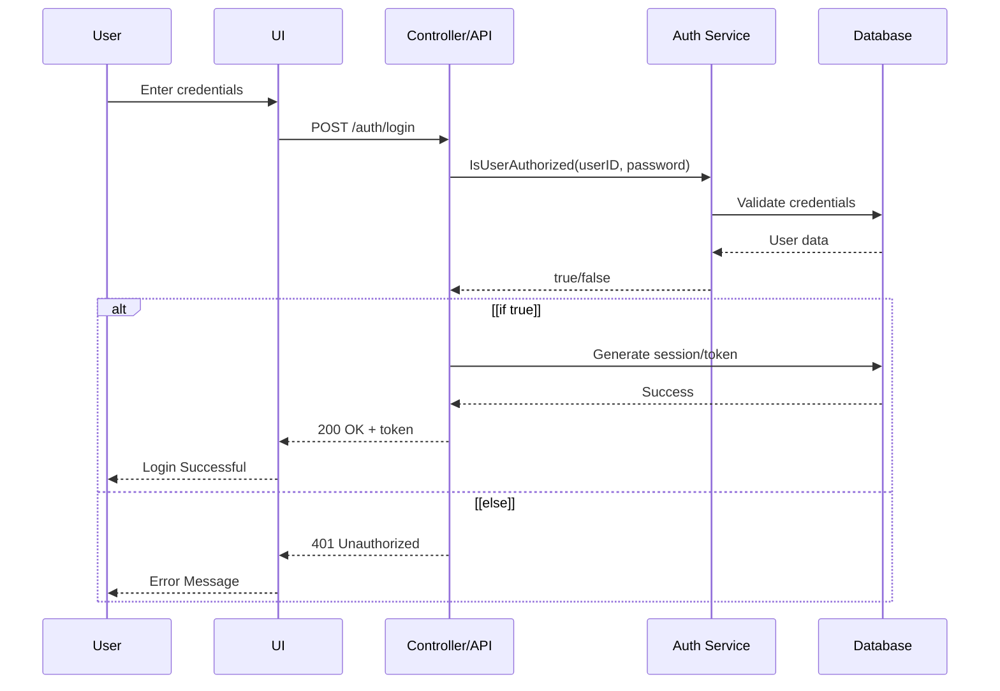
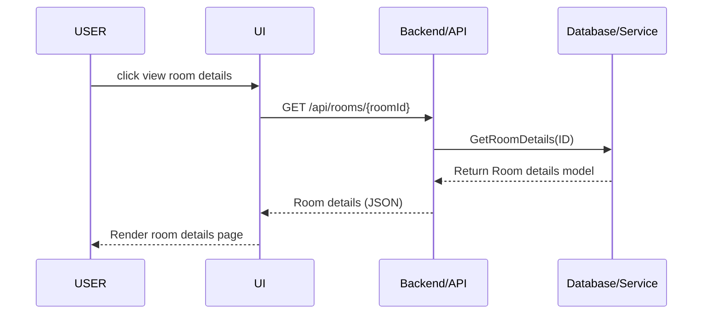
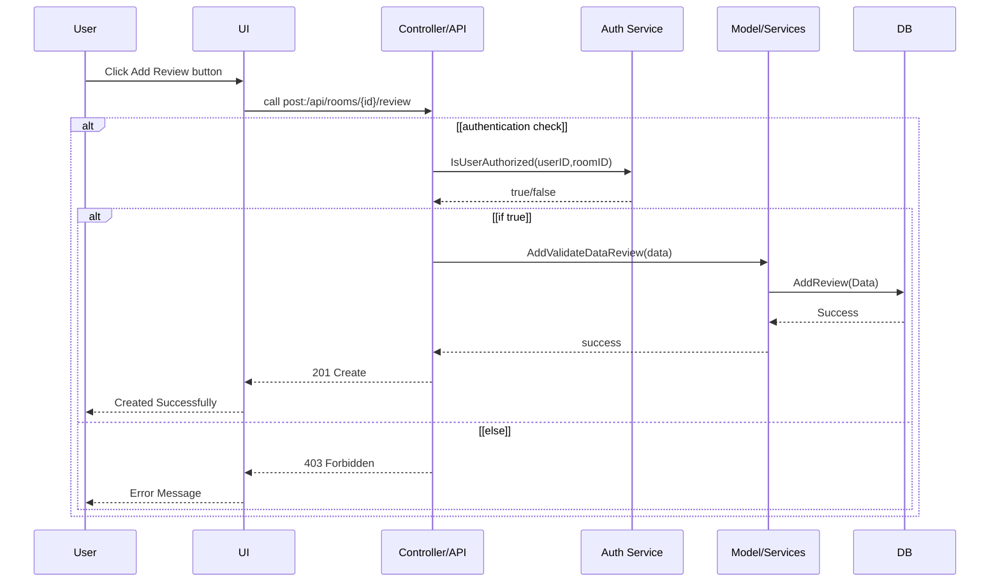
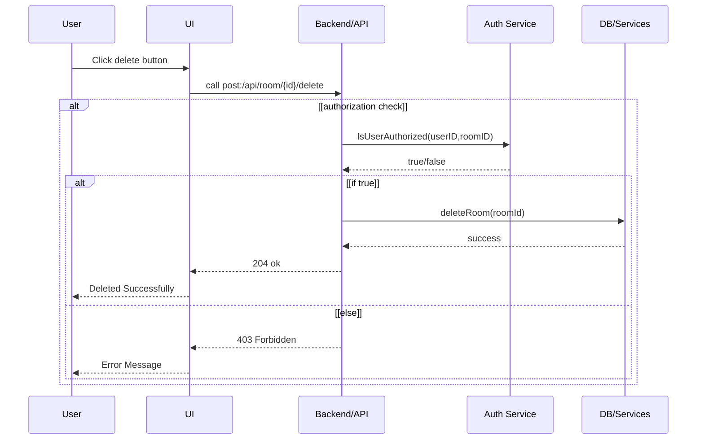

cat > sequence-diagrams.md << 'EOF'
# 🔁 Task 2: Sequence Diagrams

## 1. **Sign Up / Login**

```mermaid
sequenceDiagram
    participant U as User
    participant UI as UI
    participant API as Controller/API
    participant Auth as Auth Service
    participant DB as Database

    U->>UI: Enter credentials
    UI->>API: POST /auth/login
    API->>Auth: IsUserAuthorized(userID, password)
    Auth->>DB: Validate credentials
    DB-->>Auth: User data
    Auth-->>API: true/false
    
    alt [if true]
        API->>DB: Generate session/token
        DB-->>API: Success
        API-->>UI: 200 OK + token
        UI-->>U: Login Successful
    else [else]
        API-->>UI: 401 Unauthorized
        UI-->>U: Error Message
    end
```

## 2. **Get Room Details**

```mermaid
sequenceDiagram
    participant U as USER
    participant UI as UI
    participant API as Backend/API
    participant DB as Database/Service

    U->>UI: click view room details
    UI->>API: GET /api/rooms/{roomId}
    API->>DB: GetRoomDetails(ID)
    DB-->>API: Return Room details model
    API-->>UI: Room details (JSON)
    UI-->>U: Render room details page
```

## 3. **Add Review**

```mermaid
sequenceDiagram
    participant U as User
    participant UI as UI
    participant API as Controller/API
    participant Auth as Auth Service
    participant Service as Model/Services
    participant DB as DB

    U->>UI: Click Add Review button
    UI->>API: call post:/api/rooms/{id}/review
    
    alt [authentication check]
        API->>Auth: IsUserAuthorized(userID,roomID)
        Auth-->>API: true/false
        
        alt [if true]
            API->>Service: AddValidateDataReview(data)
            Service->>DB: AddReview(Data)
            DB-->>Service: Success
            Service-->>API: success
            API-->>UI: 201 Create
            UI-->>U: Created Successfully
        else [else]
            API-->>UI: 403 Forbidden
            UI-->>U: Error Message
        end
    end
```

## 4. **Delete Place**

```mermaid
sequenceDiagram
    participant U as User
    participant UI as UI
    participant API as Backend/API
    participant Auth as Auth Service
    participant DB as DB/Services

    U->>UI: Click delete button
    UI->>API: call post:/api/room/{id}/delete
    
    alt [authorization check]
        API->>Auth: IsUserAuthorized(userID,roomID)
        Auth-->>API: true/false
        
        alt [if true]
            API->>DB: deleteRoom(roomId)
            DB-->>API: success
            API-->>UI: 204 ok
            UI-->>U: Deleted Successfully
        else [else]
            API-->>UI: 403 Forbidden
            UI-->>U: Error Message
        end
    end
```
